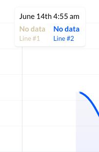

# Charting lib

Displaying customizable timeflow charts.

#### Chart types:
* line 


* point


* curve


* candle (vertical bar)


#### Allows numeric and no-data values

* Point modal showing numeric data point


* Point modal showing no-data message



## Getting Started

```
let chart = new ChartContainer('.my-selector', config); 
```

## Known issues

* (area charts (line, curve) only) fill colors blinking
* (area charts only) vertical lines bordering areas when fill color used
* preview box not available for high-speed scrolling


### License

MIT License - see the [LICENSE.md](LICENSE.md) file for details

### Acknowledgments

* Thanks to @nikitavbv for code review

Initially built for Telegram Charts Contest for developers.
